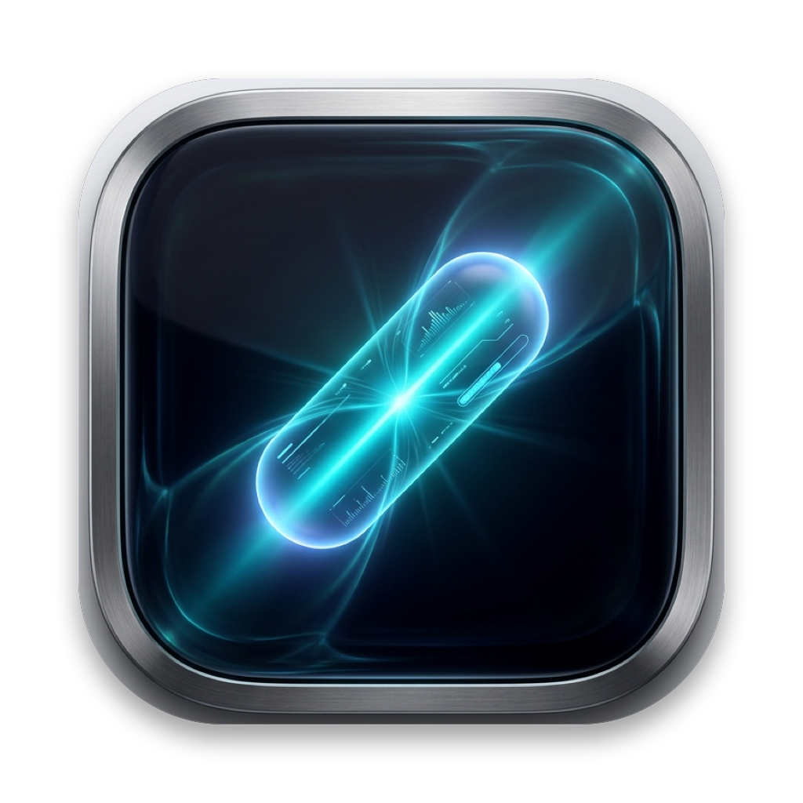
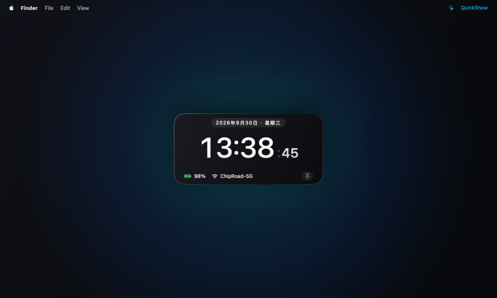

<div align="center">

  

  # QuickShow

  <p>
    <b>专为全屏沉浸与极简工作流打造的 macOS 原生极速信息悬浮窗。</b><br>
    零打断 · 即看即走 · 全键盘盲操 · 极致轻量
  </p>

  <p>
    <a href="https://github.com/dzhang1987/quick-show"></a>
    <a href="https://swift.org"></a>
    
    
    <a href="LICENSE"></a>
  </p>

  <br />

  

</div>

<br />

---

## 💡 为什么需要 QuickShow？

在 macOS 上进行全屏写代码、沉浸写作或全屏观看视频时，系统的菜单栏通常处于**自动隐藏**状态。当你想看一眼当前时间和电池状态时，往往需要用鼠标滑到屏幕顶端等待菜单栏笨拙地下落，这极大地打断了专注心流。

**QuickShow** 正是为此而生：
- 随时随地，**双击两下修饰键（默认双击 `⌘ Command`）**，黑曜石悬浮窗瞬间在屏幕正中央平滑浮现；
- 抬眼一瞥，自动在 3 秒后淡出；或者轻按 **`ESC`**，瞬间隐形并将键盘焦点毫秒级交还原应用；
- 整个过程手不离主键盘区，丝滑跟手，零心流打断。

---

## ✨ 核心特性

- ⚡️ **极致轻量与极速响应**：
  - 纯原生 Swift + AppKit 构建，零外部依赖，双击修饰键瞬时呼出；
  - 界面语言跟随系统（简体中文 / English），无需设置自动切换；
  - 后台待机时 CPU 占用严格为 0.0%，面板关闭自动深度释放内存；
  - 极简常驻后台设计，完全不占用系统资源。
- 🖥️ **专为全屏体验与多显示器设计**：
  - 覆盖于全屏应用和各种桌面空间之上，不抢夺全屏工作区；
  - **屏幕智能感知**：自动检测光标所在的当前活跃屏幕并在正中央居中展现；
  - **屏幕分辨率内容自适应（Adaptive Metrics）**：面板尺寸依据当前显示器分辨率精密自适应，内容严丝合缝紧凑包裹；偏好设置中支持一键切换「系统聚焦大号 / 适中舒适 / 极简小巧」三档尺寸，全局纯原生矢量渲染，刀锋般锐利通透。
- ⌨️ **多维盲操热键（支持偏好设置随心切换）**：
  - **双击 Command (⌘ ⌘)** [默认推荐]：全局一键呼出 / 关闭悬浮窗（极简 Toggle 开关）；
  - **双击 Control / Option / Shift**：全屏终端与开发者的防冲突替代方案；
  - **经典组合键 (⌘ + Shift + T)**：传统组合按键方案（仅在偏好设置中选择该模式时注册生效，避免与浏览器 ⌘⇧T 冲突）；
  - **ESC 键退出**：底层同步捕获，退出瞬间立即归还系统焦点，绝无粘滞卡顿；
  - **Space 键常驻切换**：按空格键在「常驻固定」与「一瞥倒计时」之间丝滑切换；
  - **智能防误触**：连续敲击修饰键途中如果按下了普通键（如 ⌘+C），自动取消唤醒判定。
- 🥷 **Dock 程序坞彻底隐形**：
  - 作为系统附属工具运行，程序坞**完全不占图标**，不打扰 ⌘ + Tab 任务切换。
- 🔋 **系统微状态感知与极致静谧底栏 (一瞥态 680 × 340 pt)**：
  - **时间绝对主角**：原生殿堂级粗体等宽大号时钟搭配秒数与顶部日期微徽章，一瞥态留白充沛呼吸；展开态时钟平滑上移贴顶，释放空间让看板充分呼吸；
  - **纯净克制状态行**：电池电量（充放电/低电预警）、网络 Wi-Fi（点击复制局域网 IP）、音频与音量（按 `M` 静音，`↑/↓` 调音量）；
  - **正在播放媒体**：感知任意播放源的当前曲目（含 Safari/B 站等网页视频），点击微标跳转来源应用；`⏎` 播放/暂停、`←/→` 切歌、`,`/`.` 后退/快进 15 秒全键盘盲操，暂停时弱化呈现；
  - **临近会议提醒**：下一场日程不足 5 分钟时，底栏自动亮起倒计时胶囊；
  - **右侧极简无干扰**：右下角仅保留纯净单图标图钉（按 Space 切换）；彻底剔除多余文字大胶囊、常驻问号与齿轮设置；
  - **「不激活即隐形」哲学**：咖啡因防休眠（按 `A` 开启）与专注模式（按 `D` 切换）仅在生效激活时点亮微标，平时极度安静；
  - **智能倒计时生命周期**：鼠标悬停（Hover）时自动冻结倒计时，移出后平滑继续；
  - **底部倒计时微光进度条**：一瞥模式下，面板底边悬浮一道 2.5pt 细若光丝的微光带，随倒计时从左右两侧向中间对称收拢（消散终点收敛于面板中心），两端柔和羽化，明暗随玻璃自适应。
- 📊 **Bento Grid 监控看板 (按 `Tab` 键展开 740 × 520 pt)**：
  - **性能与网络概览**：实时展示 CPU、内存动态负载槽及当前 Top 高占用进程；支持按 **`C` 键**一键释放内存；双击卡片直达系统「活动监视器」；实时上下行网速、TCP 握手延迟与内网 IP 复制；
  - **效率、日程与直达**：内置极简番茄钟（20pt 大号倒计时，按 **`P` 键**启停，快捷轮换 25m/45m/5m 预设，展示今日完成数与连续天数统计）；智能识别日程中的腾讯会议、Zoom、Google Meet、飞书会议链接并高亮微胶囊「一键入会」；展开态完整媒体卡片（封面、进度条与时长）；日历卡底部世界时钟（城市可配置）；感知主磁盘剩余空间，按 **`O` 键**秒开「下载目录」；按 **`L` 键**一键锁屏离座，按 **`X` 键**清洗剪贴板为纯文本。
- 📅 **整面板日历视图 (按 `G` 键任意状态直达)**：
  - **月 / 周 / 日三视图**：`1 / 2 / 3` 键即时切换，`← / →` 翻页（日历视图内优先翻页，退出后恢复媒体切歌）；日历独占整个面板，浏览完毕按 `G` 或 `Tab` 平滑回到原状态；
  - **农历与传统历法**：每格附农历日次（初一显示月名），干支纪年 + 生肖，春节 / 元宵 / 端午 / 中秋等传统节日与全年 24 节气自动标注；
  - **今日日程管理**：完整日程列表与详情，智能识别腾讯会议 / Zoom / Google Meet / 飞书链接一键入会；内置轻量表单直接新建 / 编辑 / 删除日程（写入系统日历）；
  - **临近会议提醒**：下一场日程不足 5 分钟时，一瞥态底栏自动亮起倒计时胶囊。
- 🤖 **AI 对话窗口 (双击 `⌥ Option` 或主面板按 `I` 唤出)**：
  - **独立窄长居中玻璃窗口**：整窗原生 Liquid Glass 玻璃（系统级折射模糊与受光边缘），黑曜石 / 琥珀主题、明暗自适应，不抢 Dock 与 ⌘Tab；
  - **OpenAI 兼容端点随意接**：只需在设置中填写 Base URL / API Key，适配官方 / 中转 / 阿里云百炼 / 本地 Ollama / vLLM 等任意兼容端点；API 协议可选 **Chat Completions（通用兼容）** 或 **Responses（OpenAI 官方新协议）**；
  - **多会话管理**：左侧会话列表按「置顶 / 今天 / 昨天 / 7 天内 / 更早」分组，支持搜索全文定位、置顶、重命名、删除；`⌘N` 新建会话、`⌘B` 收起 / 展开会话列表、`⌘F` 聚焦搜索；会话标题由 AI 自动生成；旧单会话数据自动迁移不丢失；
  - **阅读位置记忆**：每个会话记住你上次的阅读位置，切回原地续读（重启后同样记得）；长消息完整渲染，滚动中不跳动、不跳消息；
  - **多模型管理与随切随用**：设置中维护「我的模型」常用列表，可一键从端点拉取全部可用模型挑选加入；对话窗输入区胶囊随时切换模型与思考强度（同一入口），下一轮立即生效——不同问题用不同模型；模型选择按会话记忆，各会话互不影响，新会话默认使用设置中的默认模型；
  - **流式打字机回复**：逐 token 边生成边渲染，回复支持完整 Markdown——一至六级标题、粗 / 斜 / 删除线、下划线 / 高亮 / 上下标、行内代码与代码块（190+ 语言语法高亮、明暗外观自适应、一键复制）、列表（有序 / 无序 / 任务勾选 / 多级嵌套）、表格（列对齐）、引用、脚注、图片（网络 / 本地 / 内嵌，链接图片可点击跳转）、链接（行内式 / 引用式 / 自动识别）与常用内嵌 HTML 标签，数学公式按 LaTeX 真排版（行内与块级，覆盖常用命令：分式 / 根号 / 上下标 / 矩阵 / 求和积分 / 逻辑与否定关系 / 字号阶梯等，支持中文混排）；
  - **滚动不打扰**：流式输出只在停留在底部时自动跟随；上滚阅读历史时，新消息到达、切换会话都不会把视图拉走，但你发出的消息会直接跳回最新；阅读历史时右缘显示消息刻度轨（悬停预览消息内容、点击直达），右下角回底按钮一键跳回最新，回到底部自动隐藏；
  - **思考过程可见**：推理模型的思考过程以折叠摘要行呈现（生成中实时更新），点击展开完整查看，回复完成后仍可回看；
  - **思考强度可调**：与模型选择同一胶囊内提供「关闭 / 低 / 中 / 高」档位（默认跟随模型自身设置），按会话生效——快速问答关思考、复杂问题上强度；手动覆盖档位后胶囊尾部以信号条直观显示当前强度；个别不支持关闭思考的模型自动隐藏「关闭」档；
  - **上下文水位与自动压缩**：输入区水位圆环实时显示当前会话的上下文用量（亮弧比例，悬停查看用量明细），点击圆环手动压缩（保留最近一轮原文、其余历史合并为一份摘要）、压缩结果即时提示；水位到达 70% 时自动将早期对话压缩为摘要（会话流中以折叠卡标注、可展开查看，原始消息仍留在会话里），长对话不丢关键信息；
  - **钉住常驻**：右上角图钉置顶钉住——切走应用不再自动隐藏，跨重启记住状态；`ESC` 仍可随时关闭；
  - **窗口自由摆放**：顶部拖动条移动窗口（磁吸屏幕中心 / 左右半屏 / 贴顶对齐），四边四角拉伸调整大小，位置与大小按显示器独立记忆，呼出自动跟随鼠标所在屏幕；
  - **完成通知**：切走后回复完成时系统通知提醒（附回复摘要），点击通知直接唤出对话窗定位该会话；
  - **图片提问**：支持粘贴、拖入或文件选择图片作为附件（需模型支持视觉输入），消息内缩略图点击放大查看；
  - **AI 工具调用**：AI 能实际动手——联网搜索、阅读网页正文、读写剪贴板、查看系统状态、打开应用、读写白名单目录内文件、读写环境变量、地图（定位 / 地点搜索 / 路线规划）、向用户提问、预览本地文件等 21 个内置工具；危险操作（写文件 / 执行命令）执行前从输入框上方滑出确认抽屉，可拒绝或本会话内总是允许；每个工具可在设置中按类别单独开关；
  - **对话内文件预览**：AI 可在对话中预览本地文件（图片、PDF、文档、音视频等），以系统 Quick Look 原生渲染的卡片直接呈现，无需切出应用；
  - **先问再做**：指令模糊或方案有分支时，AI 会从输入框上方滑出提问抽屉向你确认——一次最多 5 题、每题 2-6 个选项可点选（单选 / 多选），也可直接输入文字作答，确认后才动手不瞎猜；
  - **对话内地图卡片**：AI 规划路线或展示地点时，结果直接渲染为可拖动、缩放的原生地图卡片（标注点、路线折线、一键在系统地图中打开、复制坐标）；支持「我在哪」「附近的咖啡店」「从我这到天安门」类问题；数据源高德优先、Apple 地图兜底，可选配置高德 Web 服务 Key 获得更准的国内数据与公交路线支持；
  - **消息操作**：所有消息支持复制（操作行按钮 / 右键菜单 / 选中文字直接 ⌘C），每条 AI 回复下方常驻复制 / 重新生成图标（悬停提亮），最后一条回复可一键重新生成；
  - **最后一轮撤回与编辑**：最后一条用户消息下方常驻「编辑并重发」（原地编辑，改完自动重发）与「撤回」（删除该轮，内容连图片一起回填输入框）图标（悬停提亮）；
  - **导出对话**：输入区 ⊕ 菜单一键将当前会话导出为 Markdown 并复制到剪贴板；
   - **生成中转向与追问**：回复还在生成时 `⏎` 即排队「转向」——AI 完成当前回复后按你的新指示接着写；`⌥⏎` 排队「追问」——当前回复结束后自动追加提问再答一轮；排队内容以胶囊悬在输入框上方，点击胶囊可取回编辑，多条排队依次生效；输入框空时 `⌘⌫` 撤回最近一条排队消息（胶囊悬停露出 ✕ 同样可撤回）；转向消息注入对话后带「↪ 已转向」小标记，与普通提问一眼可分；`ESC` 中止时排队内容自动回填输入框不丢失；
  - **多轮对话，关窗不丢**：全部会话跨重启保留；`⌘K` 清空当前会话重新开始；
  - **输入草稿按会话保留**：没发出去的文字自动保存——切换对话、重启 App 都不丢，各会话草稿互不干扰；发送后自动清空；
   - **全键盘盲操**：`⏎` 发送（生成中即排队转向）、`⇧⏎` 换行（中文输入法组字安全）、`⌥⏎` 追问、`⌘⌫` 撤回排队消息（输入框空时）、`⌘V` 粘贴、`⌘Z` / `⇧⌘Z` 撤销 / 重做；`ESC` 三阶段——抽屉（提问 / 危险确认）在场先关抽屉，流式生成中先按停（半截回复保留，排队内容自动回填输入框），非生成时毫秒级关窗并归还焦点；
  - **错误优雅呈现**：网络错误 / 鉴权失败 / 超时在对话流内展示并支持重试，不弹系统弹窗。
- 💎 **原生 Liquid Glass 材质美学 (macOS 26+)**：
  - 主面板、AI 对话窗与设置窗口均为整窗原生 Liquid Glass（系统级模糊折射与受光边缘，质感对标系统聚焦面板），各窗口功能控件使用官方玻璃效果；旧系统自动降级为同层级材质，与 macOS 26/27 设计语言一致，自动跟随系统「玻璃外观」设置；
  - 26pt 连续曲率圆角（窗口层统一裁剪，杜绝方角漏边）；
  - **明暗自适应**：玻璃随壁纸背景自动明暗翻转，内容层全面语义色（primary/secondary/tertiary），亮色壁纸自动切换深色文字，任何环境下高对比可读；偏好设置更支持全 App 级明暗模式钉死（自动/浅色/深色）；
  - **DesignTokens 主题令牌系统**：字体/间距/颜色/圆角/布局/动效全部语义令牌化，支持外观主题变体（默认黑曜石 / 琥珀暖色）即时切换；
  - 展开动效为"窗口单时钟"架构：AppKit 窗口动画逐帧驱动布局进度与时钟字号连续缩放（Hero 观感），过渡丝滑连贯。

---

## ⌨️ 常用快捷键一览

| 按键 / 操作 | 功能描述 |
| :--- | :--- |
| **双击 `⌘ Command`** | 快速显示 / 关闭 QuickShow 悬浮窗（全局 Toggle 开关） |
| **长按 `⌘ Command` (0.35s)** | 屏幕浮现全键盘盲操速查卡片（CheatSheet），**手指松开自动淡出收起** ⚡️ |
| **`?` 键** | 一键打开 / 收起快捷键速查卡片 ❓ |
| **`Tab` 键** | 展开 / 收起详细监控看板（展开暂停倒计时，收起恢复倒计时） |
| **`G` 键** | 任意状态直达整面板日历视图（再按返回原状态） 📅 |
| **`I` 键** | 面板激活时进入 AI 对话窗口 🤖 |
| **双击 `⌥ Option`** | 全局唤出 / 关闭 AI 对话窗口（独立于主面板热键，可在设置中更改） 🤖 |
| **`⌘ + N`** | AI 窗内新建会话 |
| **`⌘ + B`** | AI 窗内展开 / 收起会话列表 |
| **`⌘ + F`** | AI 窗内聚焦会话搜索（标题 + 消息全文） |
| **`⌘ + K`** | AI 窗内清空当前会话 |
| **`⌘ + ⌫`** | AI 窗内撤回最近一条排队中的转向 / 追问消息（输入框为空时） |
| **`⌘ + Z`** | AI 窗输入框内撤销（`⇧ + ⌘ + Z` 为重做） |
| **`1 / 2 / 3` 键** | 日历视图内切换 月 / 周 / 日 |
| **`Space 空格键`** | 切换常驻图钉（在常驻模式与一瞥倒计时模式之间切换） |
| **`M` 键** | 一键切换系统静音 / 取消静音 🔈 |
| **`↑ / ↓` 方向键** | 微调系统主音量（步进 ±5%） |
| **`⏎ 回车键`** | 播放 / 暂停当前媒体（任何播放源，含网页视频） ▶️ |
| **`← / →` 方向键** | 上一首 / 下一首曲目（日历视图内为翻页） |
| **`, / .` 键** | 后退 15 秒 / 快进 15 秒 |
| **`A` 键** | 开启 / 关闭咖啡因防休眠模式（阻止屏幕息屏） ☕️ |
| **`C` 键** | 一键优化整理系统内存（释放 inactive 内存缓存） ⚡️ |
| **`P` 键** | 番茄钟一键播放 / 暂停 🍅 |
| **`O` 键** | 在访达中瞬间打开「下载目录」 💾 |
| **`X` 键** | 剪贴板格式净化（剔除富文本，转为纯文本） 📋 |
| **`L` 键** | 全屏立即锁屏离座 🔒 |
| **`D` 键** | 打开系统专注 / 勿扰模式偏好设置 🌙 |
| **`ESC` 键** | 瞬间关闭悬浮面板（若速查表打开则优先关闭速查表），毫秒级交还焦点 ⚡️ |
| **`⌘ + Shift + T`** | 组合键呼出（仅在偏好设置中选择该模式时生效） |
| **`⌘ + ,`** | 打开偏好设置窗口 |
| **`⌘ + Q`** | 彻底退出 QuickShow |

---

## ⚙️ 偏好设置指南 (Preferences)

QuickShow 采用标准的 **macOS 现代系统侧边栏式设置中心 (System Settings Style)**，界面规整、专业典雅。在面板激活时按 **`⌘ ,`** 或点击底栏/菜单栏设置图标即可进入。

### 1. ⚙️ 通用设置 (General)
- **外观**（DesignTokens 主题令牌系统驱动）：
  - **外观主题**：**默认（黑曜石）** / **琥珀暖色**——切换面板强调色调（主时钟渐变、CPU/网速/图钉等点缀同步暖色化），选择即时生效；文本与玻璃材质的明暗自适应不受影响，绿=健康/红=警告等状态语义色保持不变；
  - **明暗模式**：**自动（跟随系统）** / **浅色** / **深色**——作用于整个 App（悬浮面板玻璃/内容、设置窗口），基于 `NSApp.appearance` 全局联动，面板展示中切换即时生效，选择自动持久化记忆；**默认深色**（首次安装即暗黑玻璃，可在设置中改回跟随系统）。
- **呼出触发方式**：
  - **双击 Command (⌘ ⌘)** *(推荐)*：两只大拇指敲击两下极速唤起/收起，全屏沉浸零打断；
  - **双击 Control (⌃ ⌃)** / **双击 Option (⌥ ⌥)** / **双击 Shift (⇧ ⇧)**：避免与终端或特定 IDE 快捷键冲突的替代选项；
  - **经典组合键 (⌘ + Shift + T)**：传统组合按键方案（仅在偏好设置中选择该模式时注册生效，避免与浏览器 ⌘⇧T 冲突）。
- **在系统菜单栏显示图标**：支持开启/关闭右上角系统状态栏 Sparkles 图标（默认展示）。
  > 💡 **提示**：隐藏菜单栏图标后，QuickShow 保持完全隐形后台运行。您仍可随时通过双击修饰键唤起面板，在面板激活时按 **`⌘ ,`** 随时重新打开偏好设置。
- **开机自动启动**：基于 macOS 原生 `SMAppService`，开机免手动拉起。
- **打开应用时默认展示一次**：应用初次拉起或重启时，在屏幕中央展示一次一瞥面板。
- **一瞥模式显示时长**：滑块支持 1.5 秒 ~ 10.0 秒自由微调（步进 0.5 秒，默认 3.0 秒）。鼠标悬停在悬浮窗上时会自动冻结倒计时。
- **时间格式**：支持切换 24 小时制与是否展示秒数 (`HH:mm:ss`)。

### 2. 💡 一瞥底栏微状态 (Status Bar)
悬浮面板底部默认展示的轻量感知微标，即看即走，各微标均支持一键快捷交互：
- **电池状态**：显示电量数值与充放电雷电标识，接电源即绿色闪电（满电插线亦显示供电状态），低电量自动红色预警；点击直达系统电池设置；
- **Wi-Fi 连接与 SSID**：点击一键复制当前局域网 IP 至剪贴板（按住 Option 点击打开网络设置）；
  - *定位权限授权*：macOS 要求获取定位权限方可读取真实 Wi-Fi 名称 (SSID)，未授权时将优雅降级显示频段（如 5G/2.4G）；
- **蓝牙外设电量**：感知 AirPods 及外接键鼠电量，电量低于 20% 醒目告警；
- **音频输出与音量**：展示当前系统主音量；点击一键切换静音/恢复；
- **正在播放的媒体**：感知任意播放源（含 Safari 网页视频）的当前曲目与来源应用，点击微标跳转来源应用；暂停时弱化呈现；
- **专注 / 勿扰模式**：当系统开启「勿扰模式」或特定「专注模式」时，优雅点亮紫色微胶囊。

### 3. 📊 监控看板 (Dashboard · 按 Tab 键展开)
敲击 `Tab` 键即可在极简一瞥与 Bento Grid 双列监控看板间无缝切换：
- **CPU & 内存系统负载条**：实时直观的负载百分比及占用最高的进程；点击微按钮一键整理清理闲置内存，双击卡片直达「活动监视器」；
- **实时网络吞吐速率**：动态监测并显示当前系统的瞬时上传与下载网速及 TCP 握手延迟；
- **极简专注番茄钟**：内置 25 分钟标准番茄钟，按 `P` 键快速启停，轻点时间预设轮换，展示今日完成数与连续天数统计；
- **下一场日历日程会议**：智能感知即将到来的日程，一键识别腾讯会议、Zoom、Google Meet 链接并高亮微胶囊「一键入会」（需授权日历读取权限）；
- **世界时钟**：日历卡底部展示 2~3 个时区时间，城市可在设置中自由配置；
- **完整媒体卡片**：展开态展示当前媒体的封面、进度条与已播/总时长。
- **整面板日历视图**：任意状态按 `G` 直达（月 / 周 / 日 + 农历节气 + 日程管理，详见核心特性）；需授权日历访问权限以显示与编辑日程，未授权时农历与节气功能不受影响。

### 4. ⌨️ 快捷键设置 (Shortcuts)
- **独立快捷键配置与速查中心**：系统化查看与管理所有按键（唤醒热键、基础交互、单键盲操功能）；
- **主面板与 AI 对话窗双路唤醒热键**：各自独立选择，修饰键支持**左右侧精确区分**（如双击左 ⌘ 唤主面板、双击右 ⌥ 唤 AI 窗）；两路热键冲突时设置界面即时红字提示并保持原配置；
- **长按 Command 速查特性**：支持在悬浮面板激活时按住 `⌘` 约 0.35s 浮现速查表，松开手指瞬间淡出收起，零记忆负担。

### 5. 🤖 AI 服务 (AI Service)
- **API 协议**：Chat Completions（通用兼容，默认）/ Responses（OpenAI 官方新协议）；
- **Base URL**：OpenAI 兼容端点根地址（自动按所选协议拼接请求路径）；
- **API Key**：仅保存于系统钥匙串（Keychain），绝不写入配置文件，避免随备份明文带走；已存储显示掩码（····末 4 位）；
- **我的模型**：常用模型精选列表（显示名 + 模型 ID，可选填写上下文窗口大小供长对话水位计算，默认 512k），可添加、排序、设为默认（新会话的初始模型）；AI 对话窗的模型切换菜单只显示这里，永远干净；
- **可用模型**：从端点一键拉取的全部模型候选池，可搜索过滤、点击 + 加入「我的模型」；几百个候选也不影响使用；
- **System Prompt（可选）**：角色设定 / 前置指令，留空不发送；
- **AI 工具开关**：按类别分组（剪贴板 / 系统状态 / 文件 / 环境变量 / 联网 / 地图 / 用户互动）逐个启用 / 停用 AI 可调用的内置工具，中文展示名 + 工具标识并列呈现，危险工具带醒目标识（执行前仍会逐个抽屉确认）；
- **文件访问白名单**：AI 读写本地文件仅限白名单目录内，未添加目录即无法访问；
- **联网搜索**：填写 Tavily API Key（存本地密钥文件，免费注册 tavily.com 获取），AI 即可联网搜索与阅读网页；
- **地图数据源（可选）**：配置高德开放平台 Web 服务 Key（存于 `~/Library/Application Support/QuickShow/amap_apikey` 纯文本文件），AI 地图工具优先使用高德数据（含公交路线规划），未配置或请求失败时自动回退 Apple 地图数据；
- **自定义环境变量**：供 AI 的环境变量工具读写，独立于系统环境变量；
- **环境变量兜底（可选）**：`QUICKSHOW_AI_BASE_URL` / `QUICKSHOW_AI_API_KEY` / `QUICKSHOW_AI_MODEL` 可在设置留空时作为默认来源。

### 6. ℹ️ 关于 (About)
展示原生应用大图标、版本号 1.6.0、架构说明、内存状态及开源许可证。

---

## 📂 项目结构

```
quick-show/
├── project.yml                          # XcodeGen 自动化工程规范配置
├── QuickShow.xcodeproj                  # 自动生成的 Xcode 项目
├── assets/                              # README 展示素材（超清图标、预览图）
│   ├── icon.png                         # 原生透明 Squircle 图标
│   └── preview.png                      # 双模式（一瞥 / 展开）左右对照产品展示图
├── scripts/
│   ├── restart.sh                       # 自动重新编译并重启 QuickShow 实例的轻量脚本
│   └── setup_codesign.sh                # 本地自签名代码签名证书初始化脚本（保证权限持久化）
├── QuickShow/
│   ├── QuickShowApp.swift               # 原生 AppDelegate 入口与 NSStatusItem 状态栏管理
│   ├── Info.plist                       # LSUIElement 常驻、日历与定位权限配置
│   ├── Assets.xcassets/                 # 1024x1024 原生超清 AppIcon
│   ├── Resources/
│   │   └── MediaRemote/                 # vendored mediaremote-adapter（BSD-3，Now Playing 数据桥接）
│   ├── AI/
│   │   ├── AIChatService.swift          # OpenAI 兼容流式客户端（双协议、vision、模型列表）与 Keychain 存取
│   │   ├── AIChatState.swift            # 对话状态门面：流式收发、合帧冲刷、标题摘要
│   │   ├── AIModelAdapter.swift         # 模型适配层：思考强度档位与上下文窗口的模型差异屏蔽
│   │   ├── ChatSessionStore.swift       # 多会话存储：分组、搜索、置顶、迁移
│   │   ├── MarkdownParser.swift         # 块级 + 行内 Markdown 解析器（纯函数 AST）
│   │   ├── ImageAttachment.swift        # 图片附件处理（JPEG base64 与缩略图）
│   │   ├── RichCard.swift               # 富内容卡片统一契约（信封解析 / 视图注册表 / 宿主视图）
│   │   └── Tools/                       # AI 工具调用（协议 / 注册表 / 执行器、内置 / 联网 / 地图工具）
│   ├── Core/
│   │   ├── AppState.swift               # 全局响应式状态驱动（核心微状态、扩展看板、番茄钟、偏好设置）
│   │   ├── AIWindowManager.swift        # AI 对话窗生命周期、居中尺寸与焦点毫秒级归还
│   │   ├── HotKeyManager.swift          # 双路双击修饰键（主面板 / AI 窗，支持左右侧）与 Carbon 快捷键管理
│   │   └── PanelManager.swift           # 悬浮窗生命周期、平滑展开/收起与焦点毫秒级管理
│   ├── Utilities/
│   │   ├── FloatingPanel.swift          # 具备 Key Window 焦点的全屏穿透透明 NSPanel (支持 ESC/Space/Tab)
│   │   ├── ScreenHelper.swift           # 鼠标活跃屏幕居中几何计算
│   │   ├── DesignTokens.swift           # 语义设计令牌：字体/间距/颜色/圆角/动效与主题变体
│   │   ├── MarkdownHighlighter.swift     # 代码语法高亮服务（vendored Highlightr 桥接：双主题/别名归一/LRU）
│   │   ├── LunarCalendar.swift          # 农历 / 干支 / 节气 / 传统节日本地计算
│   │   └── SystemStatusProvider.swift   # 系统状态与传感器原生采集 + mediaremote-adapter 桥接
│   └── Views/
│       ├── PanelView.swift              # 黑曜石毛玻璃主容器 (极简 / 展开 / 日历视图路由)
│       ├── AIChatView.swift             # AI 对话视图（侧栏、消息列表、流式渲染、输入区）
│       ├── AIChatSidebarView.swift      # 会话列表侧栏（搜索、分组、置顶/重命名/删除）
│       ├── AIChatMarkdownView.swift     # 块级 Markdown 渲染（表格/列表/标题/代码块）
│       ├── AIChatAttachmentViews.swift  # 图片附件条、缩略图与放大预览
│       ├── AIToolCardView.swift         # AI 工具调用卡片（状态徽标、参数与结果折叠展开）
│       ├── AIChatMapCardView.swift      # 交互式地图卡片（MKMapView 包装、标注与路线折线）
│       ├── CalendarView.swift           # 整面板日历视图（月/周/日网格、日程列表、编辑表单）
│       ├── TimeDisplayView.swift        # 饱满高对比度的大字时钟与日期徽章
│       ├── StatusBarView.swift          # 底部微状态栏（电池、WiFi、蓝牙、音频、勿扰、图钉、Tab键）
│       ├── ExpandedMonitoringView.swift # 展开监控看板 (CPU/内存负载、网速、日历日程、番茄钟)
│       └── SettingsView.swift           # 偏好设置界面（快捷键切换、状态项开关、日历与定位授权等）
├── AGENTS.md                            # 项目持久开发规则与协同工作规范
└── README.md
```

---

## 🛠️ 构建与运行

### 环境要求
- macOS 13.0 (Ventura) 或更高版本
- Xcode 15.0+ 
- [XcodeGen](https://github.com/yonaskolb/XcodeGen) (`brew install xcodegen`)

### 0. 配置代码签名证书（初次开发运行一次即可）
为了使日历与定位等系统隐私权限在本地重新编译后保持永久有效（避免系统因二进制签名变动重复弹窗请求授权），首次构建前可执行：
```bash
./scripts/setup_codesign.sh
```

### 1. 生成工程
```bash
xcodegen generate
```

### 2. 编译 Release 生产版本（推荐）
```bash
xcodebuild -scheme QuickShow -configuration Release -derivedDataPath build_release -destination 'platform=macOS' build
```

### 3. 运行体验
```bash
open build_release/Build/Products/Release/QuickShow.app
```

### 4. 极速调试与平滑重启
修改代码后，在项目根目录运行以下脚本即可自动完成 Release 重编译并重启实例：
```bash
./scripts/restart.sh
```

---

## 📄 开源许可证

本项目采用 [MIT License](LICENSE) 开源。欢迎 Star、Fork 与提交 PR！
